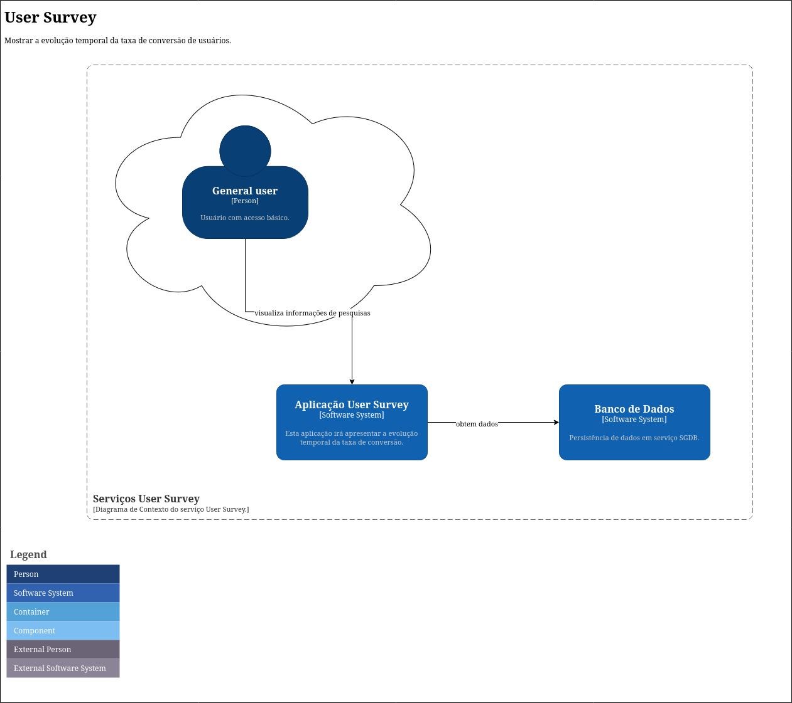

= User Survey
:toc:
:toc-title: Sumário
:doctype: book
:description: Documento de referência de Arquitetura da Solução.

== Objetivo

Apresentar os registros de decisões arquiteturais e trade-offs para
eficiência da aplicação em apresentar a *evolução temporal da taxa de conversão*.

== Contexto de negócio

* *Atores*: Usuário na internet.
* *Domínios*: Aplicação User Survey

.Contexto do sistema a ser desenvolvido

== Decisões Arquiteturais

Um registro de decisão arquitetônica (ADRfootnote:adr[_Architectural Desision Records (ADR)_ http://adr.github.io]) é um documento que registra
uma importante decisão arquitetural tomada, juntamente com seu contexto
e consequências.

.Tratamento dos requisitos e _trade-offs_.
[%header,cols="2a,3a"]
|===
| Título | Descrição

| Estilo arquitetural.
| Refere-se a uma organização estrutural de alto nível que define a organização geral do
sistema, especificando como os componentes são organizados, como eles interagem e as
restrições sobre essas interações.

[cols="1a,2a"]
!===
! Decisão ! Contexto

!Estilo arquitetural sob microserviço
!
Consiste em uma coleção de pequenos serviços autônomos. Cada serviço é
autocontido, deve implementar uma única capacidade de negócio e dentro de um contexto
delimitado, sendo: 

* _backend_: Aplicação de servidor.
* _frontend_: Aplicação Web.

! *Justificativa*
! Cada serviço pode ser publicado em produção independentemente, viabiliza uso de diferentes linguagens de programação, código fonte específico.

!*Impacto*
! Complexidade em manter todo o ecosistema de serviços, haver tantas linguagens e estruturas diferentes que o produto se torna difícil de manter, várias comunicações entre serviços que podem influir em comportamento de rede como congestionamento e latência.

! *Risco*
! Sem a construção não é possível atender ao desafio como um todo.
!===

| Construir _backend_.
| Refere-se à aplicação de servidor que manterá as regras essenciais de negócio.

[cols="1a,2a"]
!===
! Decisão ! Contexto

! Construir API REST.
! API REST é uma interface de programação de aplicações (API) que segue os princípios de design da arquitetura REST.

! *Justificativa*
! É um contrato entre o servidor e o cliente das informações, definindo o que é exigido na requisição (por parte do consumidor) e o que será entregue na resposta (por parte do servidor).

!*Impacto*
! A API REST deverá ser descrita em antecipadamente ao desenvolvimento para que tenha seu contrato de requisição/resposta bem definido.

! *Risco*
! * Aplicações clientes não poderão consumir os dados existentes.
* Comportamento em conectividade de rede como congestionamento e latência.
* Segurança em acesso aos serviços e aplicação de padrões/protocolos de segurança de software.
!===

| Construir _frontend_.
| Refere-se à aplicação cliente que irá mostrar os dados ao usuário.

[cols="1a,2a"]
!===
! Decisão ! Contexto

! Construir aplicação Web.
! App Web é uma interface de visualização onde será usado navegador web e que usa padrões de desenvolvimento HTML (e também CSS e Javascript) para mostrar os dados.

! *Justificativa*
! A aplicação web é uma solução que é executada diretamente no navegador (_browser_), não sendo preciso realizar uma instalação na máquina do usuário.

!*Impacto*
! Acesso rápido e facilitado ao serviço bastando ter um navegador web moderno. Compatibilidade entre diferentes plataformas (sistemas operacionais).

! *Risco*
! 
* Dependência de internet do usuário.
* Uso de navegador web moderno.
* Comportamento em conectividade de rede como congestionamento e latência.
* Segurança em acesso aos serviços e aplicação de padrões/protocolos de segurança de software.
!===

| Tecnologias.
| Refere-se às tecnologias a serem utilizadas pela solução.

[cols="1a,2a"]
!===
! Decisão ! Contexto

! Plataforma computacional
! Plataforma deve suportar e manter contêineres sob imagens em Docker(R), como:

* AWS Fargate (ou Google Cloud Run, Azure Container Instances, entre outros)

! Segurança
! Serviço para atenticação de usuário e de proteção às aplicações (oAuth2, IAM), como:

* AWS IAM, AWS Cognito ou Auth0

! Dados sob PostreSQL
! Serviço SGBDR PostreSQL para persistência dos dados, como:

* AWS RDS (ou Azure Database, entre outros).

! Programação
! Linguagem de programação e bibliotecas

* _backend_: NodeJS/Typescript, Express
* _frontend_: NodeJS/Typescript, ReactJS, MUI

Permite construir os serviços com alto nível de customização.

! *Justificativa*
! 
* Domínio da equipe.
* Custos e benefício aderente ao objetivo do desafio.

!*Impacto*
! Custo de habilitação de serviços em nuvem como AWS, Azure etc.

! *Risco*
!
* Comportamento em conectividade de rede como congestionamento e latência.
* Segurança em acesso aos serviços e aplicação de padrões/protocolos de segurança de software.
!===

|===

