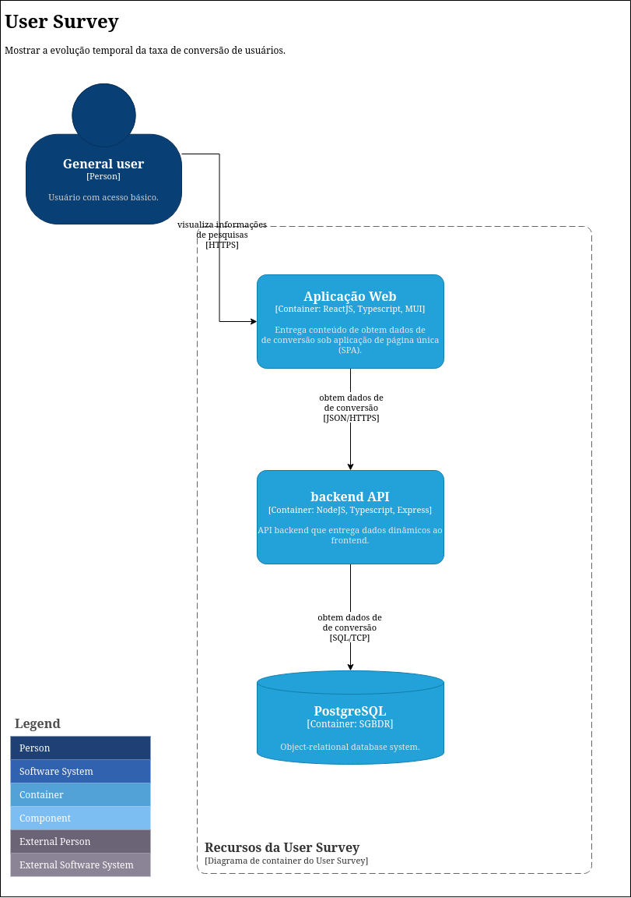
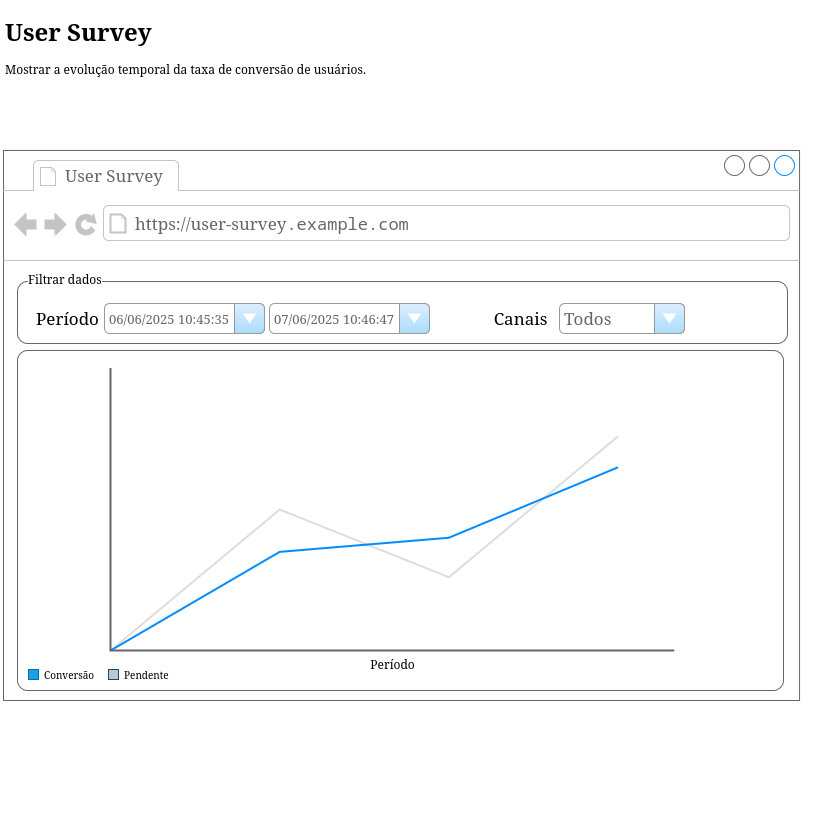

= User Survey
:toc:
:toclevels: 5
:toc-title: Sumário
:doctype: book
:description: Documento de referência de Desenho da Solução.
:stem: latexmath

== Objetivo

Apresentar os registros de decisões arquiteturais e trade-offs para
eficiência da aplicação User Surver.

Funcionalidade principal:
*  Apresentar evolução temporal da taxa de conversão.

== Visão geral

=== Arquitetura da solução

=== Requisitos funcionais

.Tratamento dos requisitos e _trade-offs_.
[%header,cols="1a,3a"]
|===
| REQ# | Descrição

| FEA001 _Atores_
| . Usuário na internet, aberto sem autenticação.

| FEA002 _Domínios_
| Aplicação User Survey

| FEA003
| Apresentar evolução temporal da taxa de conversão.

|===

==== Casos de uso

===== Taxa de conversão

Apresentar evolução temporal da taxa de conversão.

Para o cálculo da taxa foi considerada a seguinte fórmula:

[stem]
++++
taxa = \frac {quantidade\ de\ registros\ com\ status\ "Visualizou"} {quantidade\ de\ registros\ totais} \cdot 100
++++

*Mockup*

.FEA003 Evolução temporal da taxa de conversão

== API _backend_

A API REST do backend será descrita seguindo a especificação 
OpenAPI-3footnote:openapi[OpenAPI https://www.openapis.org] e sua documentação está
disponível neste repositório em 
link:docs/user_survery/openapi.json[`docs/user_survery/openapi.json`].

== Modelagem de dados

Os dados a serem trabalhados serão carregados na tabela 
`inside.users_surveys_responses_aux` e terão a seguinte estrutura:

.Colunas da tabela `inside.users_surveys_responses_aux`
[source, yaml]
----
id:                   bigint
origin:               varchar(15)
response_status_id:   integer
created_at:           timestamp, com TZ, default now()
----

A carga dos dados será realizada em tempo de deploy da aplicação que será conteinerizada.

Além disso, para otimizar o acesso aos dados serão aplicados na tabela alvo as seguintes
ações:

.Tratamento dados e _trade-offs_.
[%header,cols="2a,3a"]
|===
| Ação | Descrição

| Criar índice por `created_at, origin, response_status_id`.
| Viabilizará obter os dados de forma ordenada e ascendente em todas
as colunas.

[source, sql]
----
CREATE INDEX ON inside.users_surveys_responses_aux (created_at, response_status_id, origin);
----

| Criar visão `mv_survey_loaded_at_status` materializada e agrupada por `created_at, status`.
| Viabilizará obter os dados temporais de forma já agrupada, calculada e ascendente.

[source, sql]
----
CREATE MATERIALIZED VIEW
    inside.mv_survey_loaded_at_status AS
    SELECT to_char(created_at, 'YYYY-MM-DD HH24:MI:SS')::TIMESTAMP AS loaded_at, 
        (CASE response_status_id
            WHEN 1 THEN 'Válido'
            WHEN 2 THEN 'Inválido'
            WHEN 3 THEN 'Incompleto'
            WHEN 4 THEN 'Pendente'
            WHEN 5 THEN 'Aberto'
            WHEN 6 THEN 'Visualizou'
        END) AS status,
        count(id) 
        FROM inside.users_surveys_responses_aux 
        GROUP BY loaded_at, status;
----

| Criar índice por `loaded_at, status` para a visão materializada.
| Viabilizará obter os dados de forma ordenada e ascendente.

[source, sql]
----
CREATE INDEX ON inside.mv_survey_loaded_at_status (loaded_at, status);
----
|===

== Integrações

=== Banco de dados

O projeto utilizará o PostgreSQL como plataforma central de operações de dados.

== Segurança

A segurança é essencial para qualquer aplicação ou serviço, garantindo a sobrevivência
de qualquer negócio. É necessário garantir que todos os componentes estejam protegidos
contra falhas nessas aplicações.

Portanto, além dos ativos de infraestrutura, como IPS,
WAF e outros, a solução User Survey implementará segurança na API User Survey por meio da adoção dos componentes OPA e do proxy Envoy L7 e integração com IAM/oAuth0.

== Observabilidade

_TBD__